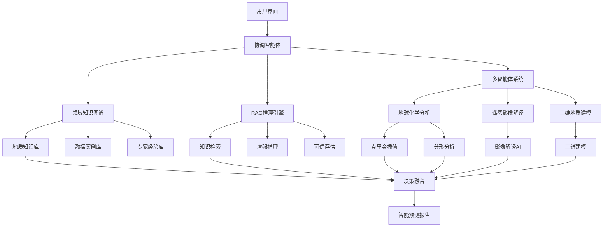

# Gold-Seeker: 融合领域知识与大模型的金矿智能预测平台

<p align="center">
  
</p>

[](https://www.python.org/)
[](LICENSE)
[](docs/)
[](RELEASE_v0.2.0.md)

**融合地质领域知识与大语言模型的金矿智能预测平台**，通过知识图谱增强的RAG技术、多智能体协作框架和专业地学算法，实现从数据到决策的全流程智能化金矿勘探预测。

**v0.2.0版本重点**：地球化学统计分析模块现已完成，集成先进的克里金插值、C-A分形分析和自动化元素筛选功能。

## 🌟 核心特性

### 🧠 领域知识与大模型融合
- **地质知识图谱**: 构建金矿勘探专业知识图谱，融合地质理论、勘探案例和专家经验
- **RAG增强推理**: 检索增强生成技术，将领域知识注入大模型，提供专业可靠的地质解释
- **多智能体协作**: Coordinator、Modeler、Analyst、Critic智能体协同工作，模拟专家团队决策过程
- **知识驱动预测**: 结合地质统计学理论与AI大模型，实现知识引导的智能预测

### 📊 地球化学统计分析 (v0.2.0重点)
- **Advanced Kriging Interpolation**: 基于PyKrige的普通克里金插值，包含变异函数分析
- **C-A Fractal Anomaly Filtering**: 自动阈值分形模型，用于地球化学异常分离
- **Automated Element Selection**: R型聚类分析，自动选择指示元素
- **GeochemProcessor**: 检测限数据处理与CLR变换
- **Statistical Analysis**: 全面的统计分析和可视化
- **Spatial Analysis**: 空间分布分析和异常识别

### 🛰️ 遥感影像解译
- **多光谱数据分析**: 自动化蚀变信息提取
- **构造解译**: 线性、环形构造自动识别
- **矿化信息提取**: 基于机器学习的矿化异常圈定

### 🗺️ 地质建模
- **三维地质建模**: 基于钻孔和剖面数据的三维建模
- **储量估算**: 传统和地统计学储量计算方法
- **成矿预测**: 多因子综合成矿预测模型

### 🤖 大模型智能解释
- **DeepSeek API集成**: 专业地质解释与勘探建议
- **知识增强推理**: 结合领域知识的智能分析
- **多模态理解**: 图表、数据、文本的综合解释
- **自动报告生成**: 智能生成地质勘探报告和决策建议

## 🚀 快速开始

### 环境要求
- Python 3.9+
- 8GB+ RAM（推荐16GB）
- 支持CUDA的GPU（可选，用于加速）

### 安装步骤

1. **克隆仓库**
```bash
git clone https://github.com/your-username/Gold-Seeker.git
cd Gold-Seeker
```

2. **创建虚拟环境**
```bash
python -m venv gold-seeker-env
source gold-seeker-env/bin/activate  # Linux/Mac
gold-seeker-env\Scripts\activate  # Windows
```

3. **安装依赖**
```bash
pip install -r requirements.txt
```

4. **配置环境变量**
```bash
cp .env.example .env
# 编辑.env文件，添加你的API密钥
```

### 快速体验

```python
from agents.tools.geochem.processor import GeochemProcessor
import pandas as pd
import matplotlib.pyplot as plt

# 初始化处理器
processor = GeochemProcessor()

# 加载数据
data = pd.read_csv('data/geochemical_samples.csv')

# 克里金插值
kriging_result = processor.interpolate_kriging(
    data, 
    target_element='Au',
    grid_resolution=0.01
)

# C-A分形分析
ca_result = processor.run_fractal_ca_model(
    data, 
    target_element='Au'
)

# 显示结果
plt.figure(figsize=(12, 5))

plt.subplot(1, 2, 1)
plt.imshow(kriging_result['grid_z'].T, extent=kriging_result['extent'], origin='lower')
plt.colorbar(label='Au (ppm)')
plt.title('Kriging Interpolation')

plt.subplot(1, 2, 2)
plt.loglog(ca_result['log_concentration'], ca_result['log_area'])
plt.xlabel('log(Concentration)')
plt.ylabel('log(Area)')
plt.title('C-A Fractal Plot')

plt.tight_layout()
plt.show()
```

## 📊 使用示例

### Streamlit界面演示
```bash
# 启动Web界面
streamlit run app.py

# 访问地址
http://localhost:8506
```

该界面提供完整的地球化学分析功能：
- 📊 数据预览和统计分析
- 🔥 相关性热力图和聚类分析
- 🎯 PCA主成分分析
- 🗺️ 空间分布和克里金插值
- 📈 C-A分形异常分析
- 🤖 AI地质解释

### 编程接口演示
```python
from agents.tools.geochem.processor import GeochemProcessor
import pandas as pd

# 初始化处理器
processor = GeochemProcessor()

# 加载数据
data = pd.read_csv('your_data.csv')

# 1. 克里金插值
kriging_result = processor.interpolate_kriging(
    data, 
    target_element='Au',
    variogram_model='spherical'
)

# 2. C-A分形分析
ca_result = processor.run_fractal_ca_model(
    data, 
    target_element='Au'
)

# 3. 结果可视化
fig, (ax1, ax2) = plt.subplots(1, 2, figsize=(15, 6))

# 克里金插值结果
im1 = ax1.imshow(kriging_result['grid_z'].T, 
                  extent=kriging_result['extent'], 
                  cmap='YlOrRd', origin='lower')
ax1.set_title('Au Kriging Interpolation')
plt.colorbar(im1, ax=ax1, label='Au (ppm)')

# C-A分形结果
ax2.loglog(ca_result['log_concentration'], ca_result['log_area'], 'b.-')
ax2.set_xlabel('log(Concentration)')
ax2.set_ylabel('log(Area)')
ax2.set_title('C-A Fractal Analysis')
ax2.grid(True, alpha=0.3)

plt.tight_layout()
plt.show()
```

## 🏗️ 项目结构

```
Gold-Seeker/
├── app.py                     # Streamlit主应用程序
├── agents/                    # 智能体模块
│   ├── coordinator.py         # 协调智能体
│   ├── modeler.py            # 建模智能体
│   ├── spatial_analyst.py    # 空间分析智能体
│   ├── critic.py             # 评估智能体
│   ├── archivist.py          # 知识管理智能体
│   └── tools/                # 工具集
│       ├── geochem/          # 地球化学工具（v0.2.0重点）
│       │   ├── processor.py  # 核心处理器（克里金、分形等）
│       │   ├── selector.py   # 元素选择工具
│       │   ├── fractal.py    # 分形分析工具
│       │   └── woe.py       # 证据权计算工具
│       ├── remote_sensing/   # 遥感工具（计划中）
│       ├── geology/          # 地质建模工具（计划中）
│       └── knowledge/        # 知识库工具（计划中）
├── config/                   # 配置文件
├── data/                     # 数据目录
├── docs/                     # 文档
├── tests/                    # 单元测试
│   ├── test_geochem_tools.py # 地球化学工具测试
│   └── test_integration.py   # 集成测试
├── examples/                  # 使用示例
│   └── complete_workflow.py  # 完整工作流示例
├── docs/                      # 文档
│   ├── user_guide/           # 用户指南
│   ├── api/                  # API文档
│   └── theory/               # 理论基础
├── config/                    # 配置文件
│   └── default_config.yaml   # 默认配置
├── data/                      # 示例数据
│   └── correct_sample_data.csv # 校正后的示例数据
├── requirements.txt            # 依赖列表
├── README.md                  # 项目说明
├── CHANGELOG.md               # 更新日志
└── RELEASE_v0.2.0.md         # v0.2.0发布说明
```

## 📚 核心理论

### 🧠 领域知识与大模型融合理论

本平台基于"领域知识+大模型"的双轮驱动理念，构建新一代金矿智能预测系统：

1. **知识图谱构建理论**
   - 地质领域知识本体建模
   - 多源异构知识融合与对齐
   - 时序知识图谱演化机制
   - 知识质量评估与推理

2. **RAG增强推理理论**
   - 检索增强生成的地质应用
   - 知识注入与提示工程
   - 领域适应性微调策略
   - 幻觉抑制与可信度评估

3. **多智能体协作理论**
   - 智能体角色建模与分工
   - 分布式决策与共识机制
   - 知识共享与通信协议
   - 协作推理与决策优化

4. **知识驱动预测理论**
   - 地质统计学与AI融合
   - 约束引导的机器学习
   - 可解释性预测模型
   - 不确定性量化与传播

### 地球化学统计分析理论 (v0.2.0重点)

1. **克里金插值理论**
   - 基于区域化变量理论
   - 变异函数建模与拟合
   - 最优无偏估计
   - 支持球状、指数、高斯模型

2. **分形异常识别**
   - C-A (Concentration-Area) 分形模型
   - 基于分形理论的背景-异常分离
   - 自动拐点检测与阈值计算
   - 多重分形维数分析

3. **多元统计分析**
   - R型聚类分析识别元素组合
   - 主成分分析降维与特征提取
   - 相关性分析与元素共生关系
   - 统计检验与显著性评估

4. **AI增强解释**
   - 深度学习模型辅助地质解释
   - 专业知识库与推理引擎
   - 自动化报告生成
   - 勘探建议与决策支持

## 🛠️ 开发指南

### 运行测试
```bash
# 运行所有测试
pytest

# 运行特定测试
pytest tests/test_geochem_tools.py

# 生成覆盖率报告
pytest --cov=agents tests/
```

### 代码格式化
```bash
# 格式化代码
black agents/ tests/ examples/

# 检查代码风格
flake8 agents/ tests/ examples/

# 类型检查
mypy agents/
```

### 文档生成
```bash
cd docs
make html
```

## 📈 性能优化

### 大数据集处理
- 使用Dask进行分布式计算
- GPU加速（CuPy支持）
- 内存优化策略

### 并行计算
```python
from joblib import Parallel, delayed

# 并行处理多个元素
results = Parallel(n_jobs=-1)(
    delayed(process_element)(data, element) 
    for element in elements
)
```

## 🤝 贡献指南

我们欢迎社区贡献！请遵循以下步骤：

1. Fork项目
2. 创建特性分支 (`git checkout -b feature/AmazingFeature`)
3. 提交更改 (`git commit -m 'Add some AmazingFeature'`)
4. 推送到分支 (`git push origin feature/AmazingFeature`)
5. 创建Pull Request

### 开发规范
- 遵循PEP 8代码风格
- 添加适当的单元测试
- 更新相关文档
- 确保所有测试通过

## 📄 许可证

本项目采用MIT许可证 - 详见 [LICENSE](LICENSE) 文件。

## 🙏 致谢

- **Carranza, E.J.M.** (2009) - 理论基础与方法论指导
- **Cheng, Q.** 等 - 分形地球化学理论贡献
- **LangChain团队** - AI框架支持
- **GeoPandas/PySAL社区** - 地理空间分析工具

## 📞 联系我们

- **项目主页**: https://github.com/your-username/Gold-Seeker
- **文档**: https://gold-seeker.readthedocs.io/
- **问题反馈**: https://github.com/your-username/Gold-Seeker/issues
- **邮箱**: your-email@example.com

## 🗺️ 项目路线图

### 📊 v0.2.0 (当前版本 - 地球化学统计分析)
- ✅ 高级克里金插值 (PyKrige)
- ✅ C-A分形异常滤波 (pwlf)
- ✅ 自动化元素筛选 (R型聚类)
- ✅ AI地质解释 (DeepSeek API)
- ✅ Streamlit Web界面
- ✅ 内存优化和大数据处理

### 🧠 v0.3.0 (领域知识图谱构建)
- 🔄 金矿勘探知识本体建模
- 🔄 地质文献智能解析与抽取
- 🔄 多源知识融合与对齐
- 🔄 知识图谱可视化与查询
- 🔄 知识质量评估体系

### 🤖 v0.4.0 (RAG增强推理系统)
- 🔄 检索增强生成核心引擎
- 🔄 领域知识注入与提示工程
- 🔄 地质专业问答系统
- 🔄 知识驱动的推理机制
- 🔄 幻觉检测与可信度评估

### 🧬 v0.5.0 (多智能体协作框架)
- 📋 Coordinator协调智能体
- 📋 Modeler建模智能体
- 📋 Analyst分析智能体
- 📋 Critic评估智能体
- 📋 智能体协作与决策融合

### 🛰️ v0.5.0 (遥感影像解译)
- 📋 多光谱数据分析
- 📋 构造信息自动提取
- 📋 蚀变信息识别
- 📋 矿化异常圈定
- 📋 遥感AI模型集成

### 🗺️ v0.6.0 (三维地质建模)
- 📋 钻孔数据三维建模
- 📋 剖面图自动生成
- 📋 储量估算系统
- 📋 成矿预测模型
- 📋 三维可视化引擎

### 🌐 v1.0.0 (完整智能平台)
- 📋 全流程智能决策支持
- 📋 多源数据融合分析
- 📋 云端部署与服务
- 📋 移动端应用
- 📋 企业级解决方案

---

<p align="center">
  
  <br>
  <strong>Gold-Seeker</strong> - 让地球化学找矿预测更智能、更精准、更高效！
</p>

### 🏗️ 系统架构概览



### 📊 v0.2.0 已完成模块
- ✅ GeochemSelector (自动特征筛选)
- ✅ GeochemProcessor (数据清洗与分形)
- ✅ FractalAnomalyFilter (C-A分形模型)
- ✅ WeightsOfEvidenceCalculator (空间评价)
- ✅ Streamlit Web界面
- ✅ AI地质解释 (DeepSeek API)

### 🧠 核心技术栈
- 🔄 **领域知识图谱**: Neo4j + PyTorch Geometric
- 🔄 **RAG推理引擎**: LangChain + DeepSeek API
- 🔄 **多智能体框架**: CrewAI + AutoGen
- 🔄 **地学算法库**: PyKrige + pwlf + scikit-learn
- 🔄 **空间数据处理**: GeoPandas + Rasterio
- 🔄 **Web界面**: Streamlit + Plotly

### 🧠 计划中模块
- 🔄 DomainKnowledgeGraph (金矿领域知识图谱)
- 🔄 RAGReasoningEngine (领域知识增强推理)
- 🔄 MultiAgentCollaboration (智能体协作框架)
- 🔄 RemoteSensingAI (遥感影像智能解译)
- 🔄 GeologicalModelingAI (三维地质建模AI)